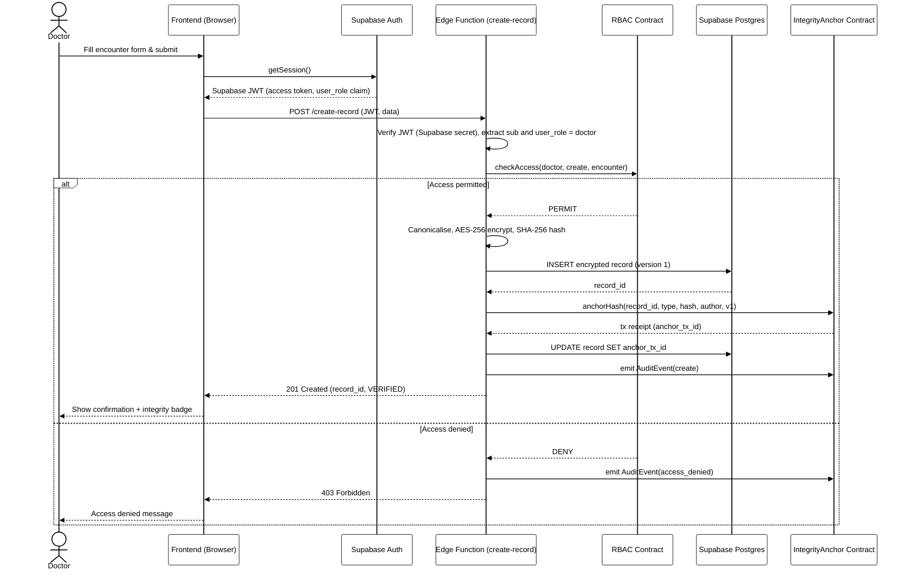
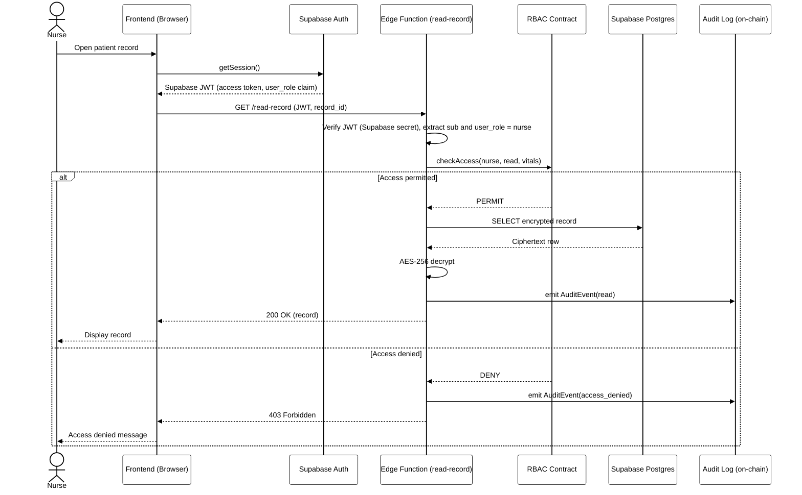
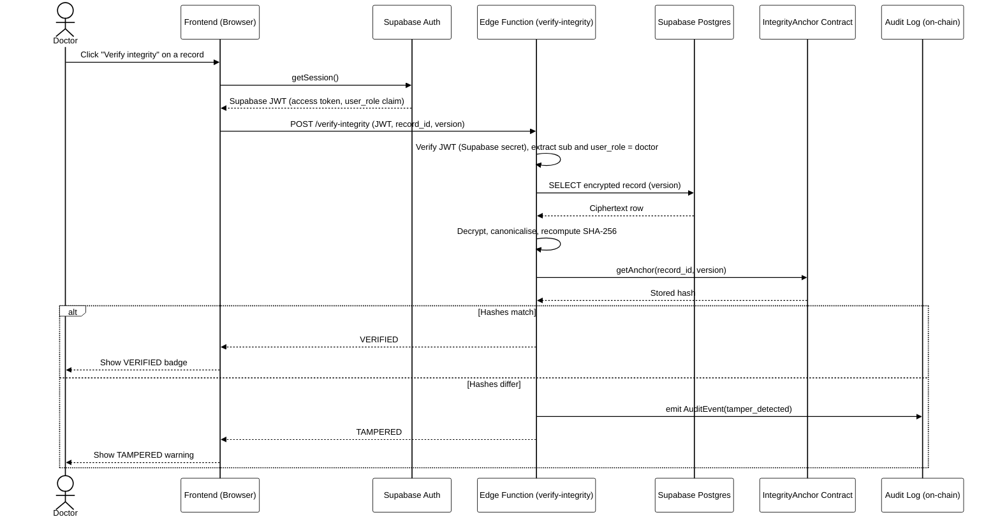
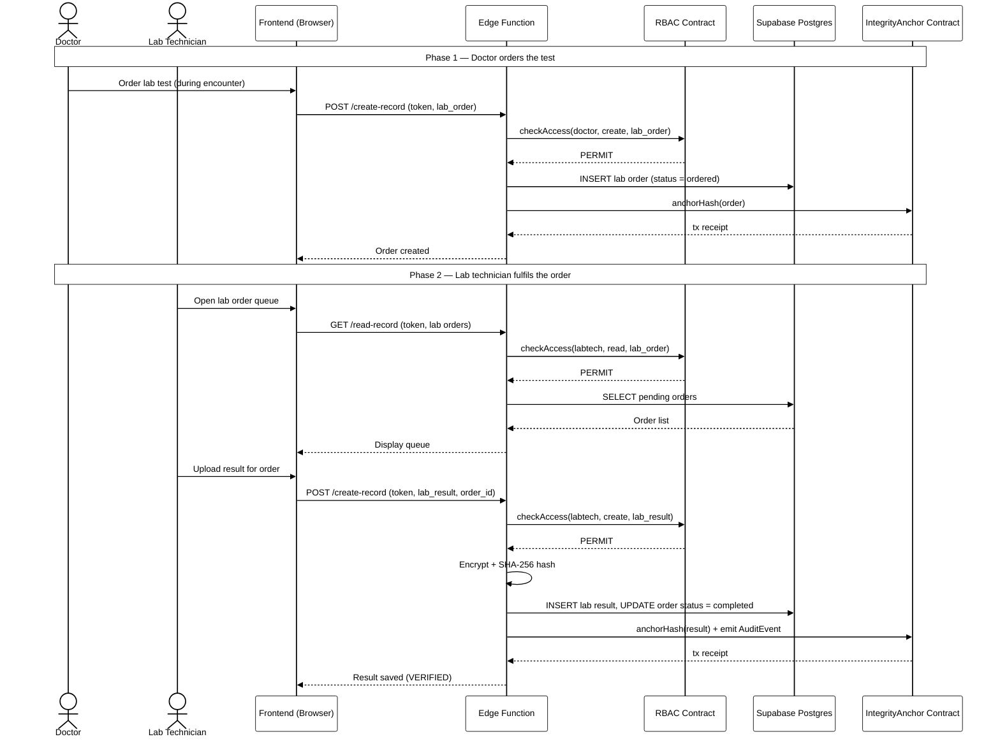
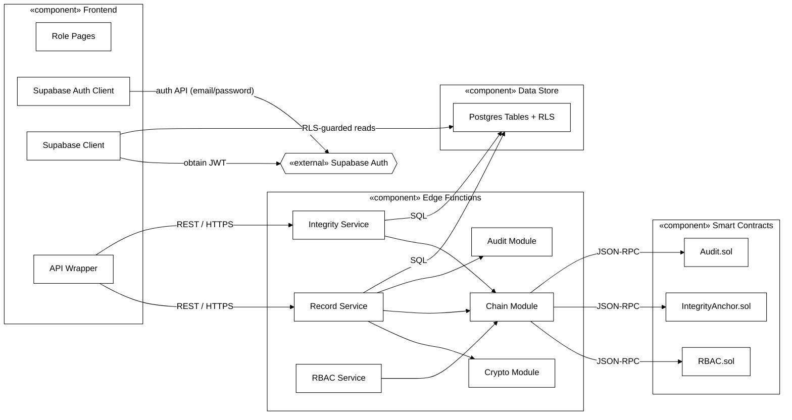
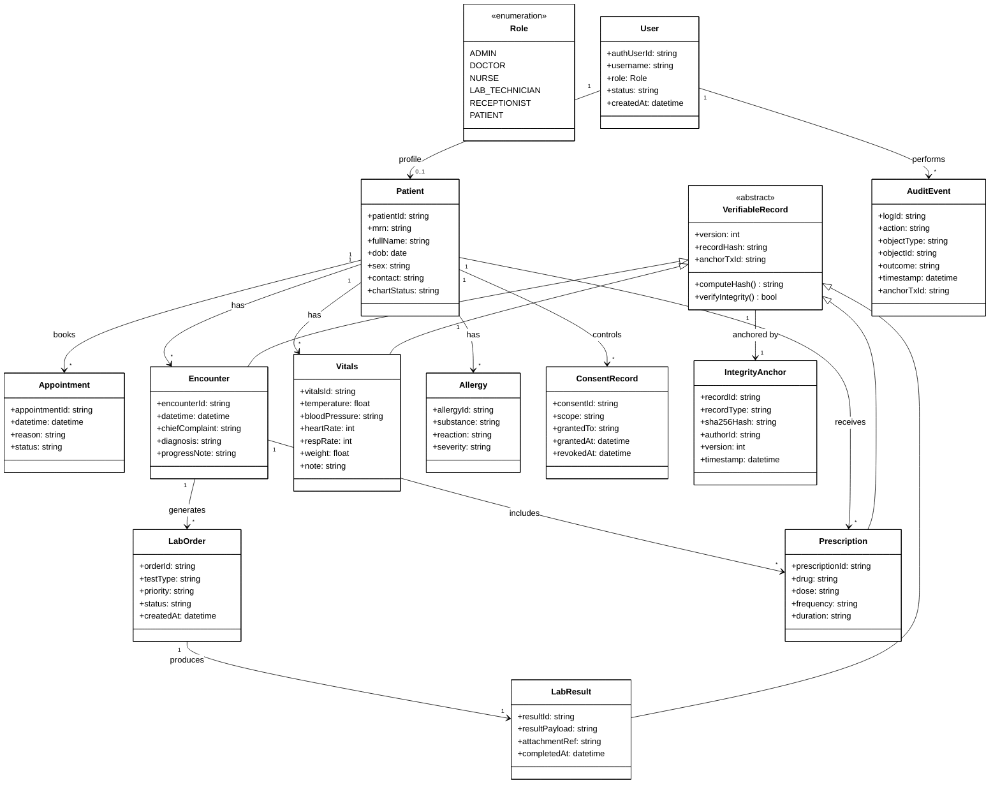

# System Diagrams — Secure EHR System

UML and architecture diagrams for the dissertation (Chapter 4). All four reflect the agreed stack: vanilla **HTML/CSS/JS** frontend, **Supabase Auth** (email/password) authentication, **Supabase** (Postgres + Edge Functions) backend/store, and a **permissioned EVM blockchain** for integrity anchoring and authoritative RBAC.

**How to turn these into images for Word:** open [mermaid.live](https://mermaid.live), paste a block, then *Actions → Export → PNG/SVG*. (VS Code with the *Markdown Preview Mermaid Support* extension also renders them.) Word can insert SVG directly and keep it crisp.

---

## 1. Use Case Diagram

The six roles, plus Supabase Auth and the permissioned blockchain as secondary actors, drawn as UML stick figures, with oval use cases inside the system boundary. Dashed `«include»` links show that every protected action includes Authenticate and every create/update includes Anchor Record Hash.

> Keep `EHR_UseCase_Diagram.svg` in the same folder as this file so the image resolves. For the dissertation, insert that SVG into Word directly (it stays sharp at any size).

---

## 2. Sequence Diagrams

Four scenarios covering the main flows — a write, a read, an integrity check, and a cross-role workflow. Together they exercise authentication, on-chain authorization (both permit and deny), encryption, hashing/anchoring, and tamper detection.

### 2.1 Doctor Creates a Clinical Encounter

The core write pipeline: authenticate, authorize on-chain, encrypt, store, hash, anchor, audit. The `alt` fragment shows both the permitted and denied paths.

### 2.2 Retrieve a Record (read pipeline + RBAC)

A nurse opens a record. The read path authorizes on-chain, fetches the ciphertext, decrypts server-side, and logs the access. The denied branch demonstrates unauthorised-access prevention.

### 2.3 Verify Record Integrity (tamper detection)

The flow that produces the tamper-detection metric: the stored record is decrypted, re-hashed, and compared with the hash anchored on-chain. Matching hashes return VERIFIED; a mismatch returns TAMPERED and is logged.

### 2.4 Lab Order to Result Workflow (multi-role)

A cross-role flow: a doctor orders a test, then a lab technician picks it up and uploads the result. Each write is hashed and anchored; the order status is updated on completion.

---

## 3. Component Diagram

The deployable components and the interfaces between them — useful for showing separation of concerns and that only the Edge Functions component bears the blockchain and crypto responsibilities.

---

## 4. Class Diagram

The domain model. Clinical records (Encounter, Vitals, LabResult, Prescription) inherit from an abstract `VerifiableRecord` that carries the version, hash, and on-chain anchor reference plus the `computeHash()` / `verifyIntegrity()` behaviour — so integrity is a shared, reusable property rather than repeated per class. Each verifiable record is anchored by exactly one `IntegrityAnchor`.

---

*End of document.*
